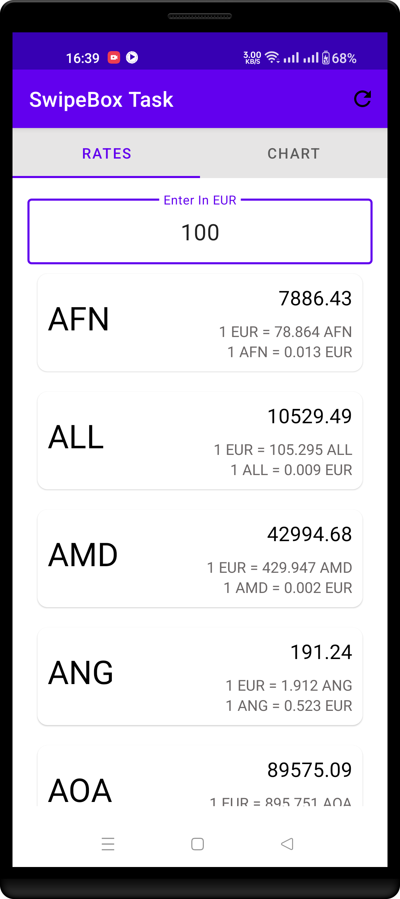
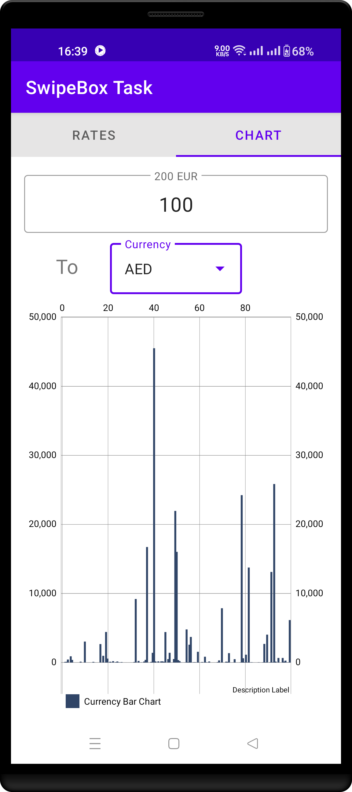

# Android MVVM Exchange Rate Currency App ().
This is a sample app  that uses Currency Api [ExchangeRates](https://app.exchangerate-api.com/dashboard).
Create Bar Chart Using Api [MPAndroidChart](https://github.com/PhilJay/MPAndroidChart).
This project is generated from template [Android MVVM Example](https://github.com/SmartAppsDevelopment/GeneralMvvmTemplate)

# Arch Component.
 #view binding
 #material design
 #Retrofit
 #Repository Pattern
 #Gson

# Inspired From Project .
This is a sample app  that uses Currency Api [RepositoryPattern](https://github.com/google-developer-training/android-kotlin-fundamentals-apps/tree/master/RepositoryPattern).

# Inspired From Project .
Basic Project Architecture { Service Layer  --> Repository Layer --> ViewModel --> Android Activity/Fragment }
Dagger Hilt to manage Dependency.

## Libraries Used
* [chukcer](https://github.com/ChuckerTeam/chucker) for Showing Apis calls

## Screenshot
Main Screenshot|Main Select Lang|Searched Data Result
:--:|:--:|:--:|
||

